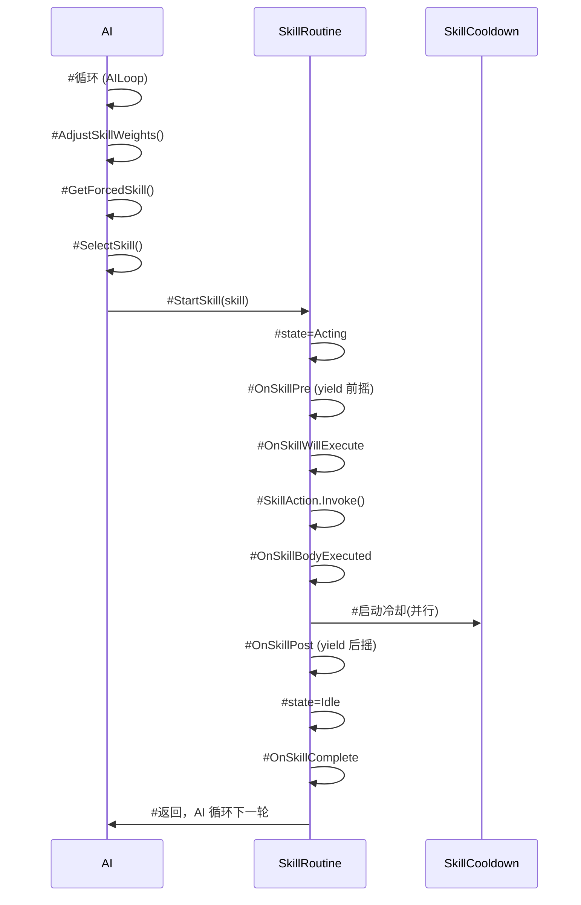

```mermaid
sequenceDiagram
AI ->> AI: #35;循环 (AILoop)
AI ->> AI: #35;AdjustSkillWeights()
AI ->> AI: #35;GetForcedSkill()
AI ->> AI: #35;SelectSkill()
AI ->> SkillRoutine: #35;StartSkill(skill)
SkillRoutine ->> SkillRoutine: #35;state=Acting
SkillRoutine ->> SkillRoutine: #35;OnSkillPre (yield 前摇)
SkillRoutine ->> SkillRoutine: #35;OnSkillWillExecute
SkillRoutine ->> SkillRoutine: #35;SkillAction.Invoke()
SkillRoutine ->> SkillRoutine: #35;OnSkillBodyExecuted
SkillRoutine ->> SkillCooldown: #35;启动冷却(并行)
SkillRoutine ->> SkillRoutine: #35;OnSkillPost (yield 后摇)
SkillRoutine ->> SkillRoutine: #35;state=Idle
SkillRoutine ->> SkillRoutine: #35;OnSkillComplete
SkillRoutine ->> AI: #35;返回，AI 循环下一轮
```