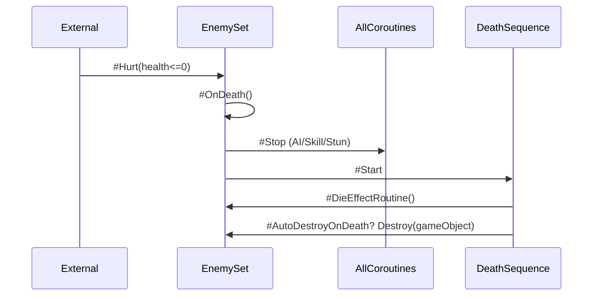

```mermaid
sequenceDiagram
External ->> EnemySet: #35;Hurt(health<=0)
EnemySet ->> EnemySet: #35;OnDeath()
EnemySet ->> AllCoroutines: #35;Stop (AI/Skill/Stun)
EnemySet ->> DeathSequence: #35;Start
DeathSequence ->> EnemySet: #35;DieEffectRoutine()
DeathSequence ->> EnemySet: #35;AutoDestroyOnDeath? Destroy(gameObject)
```