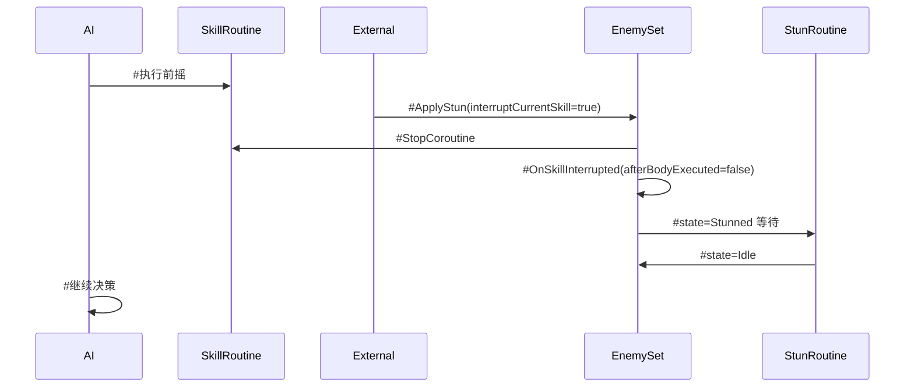

```mermaid
sequenceDiagram
AI ->> SkillRoutine: #35;执行前摇
External ->> EnemySet: #35;ApplyStun(interruptCurrentSkill=true)
EnemySet ->> SkillRoutine: #35;StopCoroutine
EnemySet ->> EnemySet: #35;OnSkillInterrupted(afterBodyExecuted=false)
EnemySet ->> StunRoutine: #35;state=Stunned 等待
StunRoutine ->> EnemySet: #35;state=Idle
AI ->> AI: #35;继续决策
```